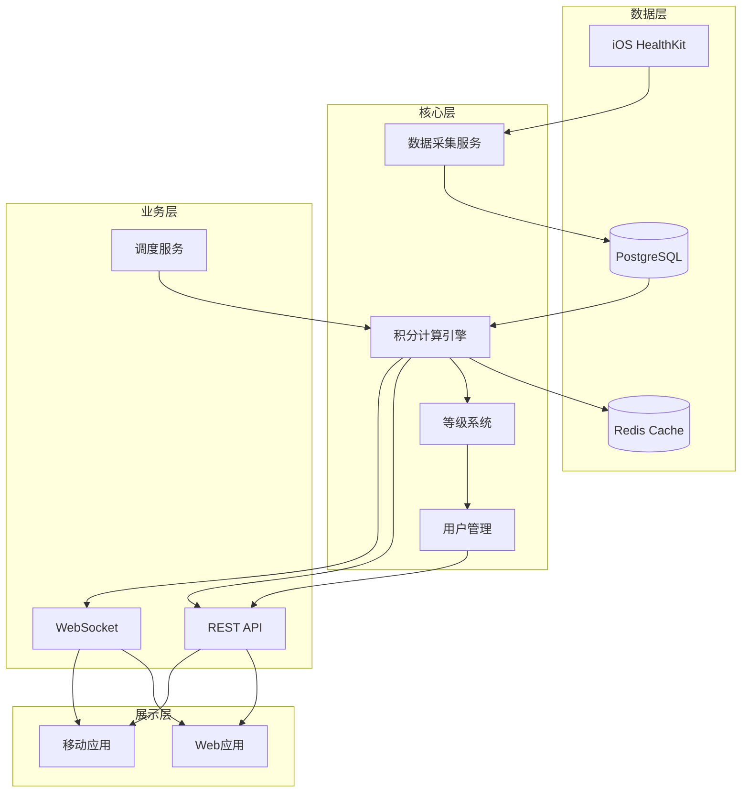
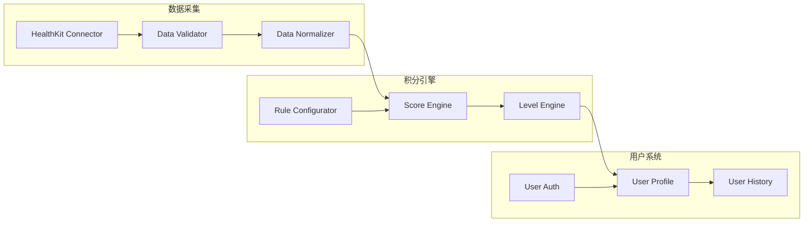

# System Patterns: LSP积分系统

## 系统架构概览



## 核心设计模式

### 1. 数据流架构
```
原始数据 → 数据验证 → 标准化处理 → 存储 → 计算 → 缓存 → 展示
```

#### 数据采集模式
- **批量导入**：处理历史数据和大量数据导入
- **实时同步**：处理实时数据更新
- **增量更新**：只处理变化的数据

#### 数据存储模式
- **时序数据**：使用时间戳索引优化查询
- **聚合数据**：预计算常用统计数据
- **冷热分离**：历史数据和实时数据分开存储

### 2. 积分计算架构

```python
# 积分计算流程
class ScoreCalculator:
    def calculate(self, user_id: str, date: datetime) -> Dict:
        # 1. 获取用户数据
        health_data = self.fetch_health_data(user_id, date)
        
        # 2. 分维度计算
        scores = {}
        for dimension in DIMENSIONS:
            calculator = self.get_calculator(dimension)
            scores[dimension] = calculator.calculate(health_data)
        
        # 3. 应用规则引擎
        scores = self.apply_rules(scores, health_data)
        
        # 4. 计算总分
        total_score = self.calculate_total(scores)
        
        # 5. 更新等级
        level_update = self.check_level_update(user_id, total_score)
        
        return {
            'scores': scores,
            'total': total_score,
            'level_update': level_update
        }
```

### 3. 规则引擎设计

#### 规则类型
1. **基础规则**：直接的数值到积分映射
2. **条件规则**：基于多个条件的复杂计算
3. **连锁规则**：行为之间的相互影响
4. **惩罚规则**：负面行为的积分扣除

#### 规则配置化
```yaml
sleep_rules:
  easy:
    condition: "sleep_hours >= 7.5"
    points: 1000
    special_cases:
      - condition: "has_sleepless_gene"
        override_hours: 6
  
  medium:
    conditions:
      - "deep_sleep_hours > 1.5"
      - "rem_sleep_hours > 1.5"
    points: 2000
    
  chain_punishment:
    condition: "sleep_hours < 6 for 3 days"
    affects: ["sleep", "exercise", "cognition"]
    recovery: "sleep_hours >= 7.5 for 6 days"
```

### 4. 等级系统设计

```python
class LevelSystem:
    LEVELS = {
        'BRONZE': {'min_points': 0, 'multiplier': 1.0},
        'SILVER': {'min_points': 33000, 'multiplier': 1.2},
        'GOLD': {'min_points': 220000, 'multiplier': 1.5},
        'PLATINUM': {'min_points': 1000000, 'multiplier': 2.0},
        'DIAMOND': {'min_points': 3000000, 'multiplier': 3.0},
        'AMBASSADOR': {'min_points': 10000000, 'multiplier': 5.0}
    }
    
    def calculate_level(self, total_points: int, 
                       wearable_connected: bool,
                       identity_verified: bool,
                       omics_tests: int) -> str:
        # 基础等级判断
        level = self.get_base_level(total_points)
        
        # 额外条件验证
        if not self.verify_conditions(level, wearable_connected, 
                                     identity_verified, omics_tests):
            level = self.downgrade_level(level)
            
        return level
```

### 5. 缓存策略

#### 多级缓存
1. **应用内存缓存**：最常访问的数据（如用户当前积分）
2. **Redis缓存**：
   - 用户今日积分详情
   - 排行榜数据
   - 实时统计数据
3. **数据库缓存**：预计算的聚合数据

#### 缓存更新策略
- **写透缓存**：更新数据时同时更新缓存
- **延迟失效**：设置合理的TTL
- **预热机制**：系统启动时加载热点数据

### 6. 数据一致性保证

#### 事务设计
```python
async def update_user_score(user_id: str, scores: Dict):
    async with db.transaction():
        # 1. 插入积分明细
        await db.insert_score_detail(user_id, scores)
        
        # 2. 更新用户总分
        await db.update_user_total_score(user_id)
        
        # 3. 检查并更新等级
        await db.update_user_level(user_id)
        
        # 4. 记录积分变化日志
        await db.log_score_change(user_id, scores)
```

#### 幂等性设计
- 使用唯一事务ID防止重复计算
- 数据导入使用upsert避免重复
- API请求使用请求ID去重

### 7. 扩展性设计

#### 插件化架构
```python
class DimensionCalculator(ABC):
    @abstractmethod
    def calculate(self, health_data: Dict) -> int:
        pass
    
    @abstractmethod
    def get_rules(self) -> Dict:
        pass

# 新增维度只需实现接口
class NewDimensionCalculator(DimensionCalculator):
    def calculate(self, health_data: Dict) -> int:
        # 实现具体计算逻辑
        pass
```

#### 数据源扩展
- 统一的数据适配器接口
- 支持多数据源聚合
- 数据源优先级配置

## 关键技术决策

### 1. 为什么选择PostgreSQL
- 强大的JSON支持，适合存储HealthKit的复杂数据
- 优秀的时序数据查询性能
- 成熟的事务支持
- 丰富的聚合函数

### 2. 为什么需要Redis
- 实时积分查询的性能要求
- 排行榜等热点数据的快速访问
- 分布式锁实现
- 会话管理

### 3. 异步处理策略
- 积分计算使用异步任务队列
- 批量数据导入使用后台任务
- 实时通知使用WebSocket

### 4. 安全考虑
- 数据加密存储
- API认证和授权
- 防作弊机制
- 审计日志

## 组件关系



## 错误处理模式

### 1. 数据异常处理
- 数据验证失败：记录日志，标记异常数据
- 数据缺失：使用默认值或跳过计算
- 数据冲突：以最新数据为准

### 2. 计算异常处理
- 规则配置错误：使用默认规则
- 计算超时：使用缓存或估算值
- 依赖服务失败：降级处理

### 3. 系统异常处理
- 数据库连接失败：使用连接池重试
- 缓存失效：直接查询数据库
- 服务过载：限流和熔断