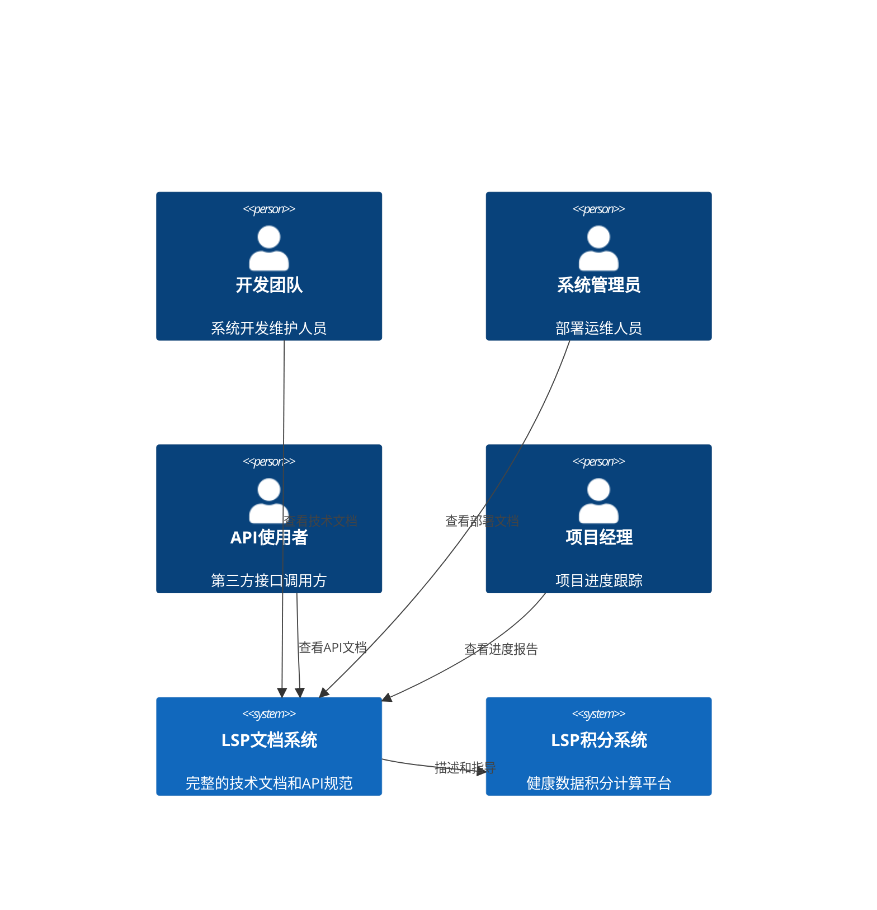
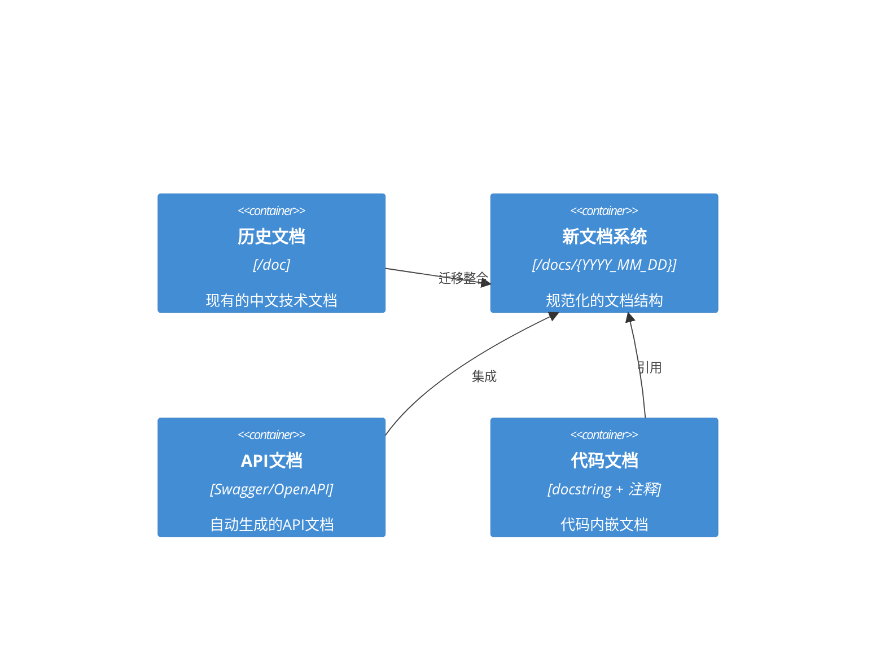
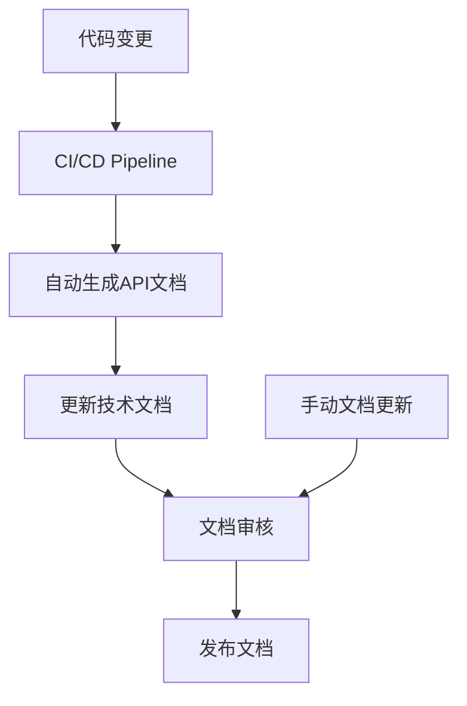

# LSP系统文档架构设计

## 文档架构总览

### 系统上下文


### 文档容器架构


## 文档分类体系

### 按文档类型分类

| 文档类型 | 目录位置 | 描述 | 受众 |
|---------|---------|------|------|
| **技术规格** | `docs/{YYYY_MM_DD}/specs/` | 功能需求、系统规格、实现状态 | 开发团队、项目经理 |
| **设计文档** | `docs/{YYYY_MM_DD}/design/` | 架构设计、技术选型、设计决策 | 开发团队、架构师 |
| **任务清单** | `docs/{YYYY_MM_DD}/tasks/` | 开发任务、待办事项、里程碑 | 项目经理、开发团队 |
| **API文档** | `docs/{YYYY_MM_DD}/api/` | RESTful API规范、接口文档 | API使用者、前端开发 |
| **运维文档** | `docs/{YYYY_MM_DD}/operations/` | 部署指南、配置说明、监控 | 系统管理员 |
| **历史文档** | `doc/` | 现有的中文技术文档 | 所有用户 |

### 按功能模块分类

#### 睡眠模块文档
- `sleep_enhancement_spec.md` - 睡眠功能增强规格
- `sleep_analysis_service.md` - 睡眠分析服务文档
- `sleep_data_sources.md` - 睡眠数据源管理
- `sleep_scoring_rules.md` - 睡眠积分规则

#### 积分计算模块文档  
- `score_percentage_spec.md` - 积分百分比功能规格
- `score_config_guide.md` - 积分配置使用指南
- `dimension_calculators.md` - 维度计算器文档
- `score_engine_architecture.md` - 积分引擎架构

#### 系统架构文档
- `system_architecture.md` - 整体系统架构
- `service_architecture.md` - 服务架构设计
- `data_architecture.md` - 数据架构设计
- `api_architecture.md` - API架构设计

## 文档目录结构

### 标准目录结构
```
docs/
├── 2025_09_07/                    # 当前日期目录
│   ├── specs/                     # 技术规格文档
│   │   ├── requirements.md        # 需求规格 ✅
│   │   ├── user-stories.md        # 用户故事 ✅  
│   │   ├── acceptance-criteria.md # 验收标准 ✅
│   │   ├── sleep_enhancement_spec.md
│   │   ├── score_percentage_spec.md
│   │   └── api_changes_spec.md
│   ├── design/                    # 设计文档
│   │   ├── architecture.md        # 本文档 ✅
│   │   ├── service_architecture.md
│   │   ├── data_model_design.md
│   │   └── integration_design.md
│   ├── api/                       # API文档
│   │   ├── api-spec.md           # OpenAPI规格
│   │   ├── endpoints_reference.md
│   │   └── authentication_guide.md
│   ├── tasks/                     # 任务和清单
│   │   ├── implementation_roadmap.md
│   │   └── testing_checklist.md
│   └── operations/               # 运维文档
│       ├── deployment_guide.md
│       └── monitoring_setup.md
├── 2025_09_06/                   # 历史日期目录
│   └── specs/
│       ├── lsp_implementation_status.md ✅
│       ├── score_percentage_feature.md ✅
│       └── sleep_stages_feature.md ✅
└── templates/                    # 文档模板
    ├── spec_template.md
    ├── design_template.md
    └── api_template.md

doc/                              # 历史文档目录 (保持不变)
├── LSP积分实现进度.md ✅
├── LSP积分系统数据需求整理.md ✅  
├── Docker部署方案.md ✅
└── memory-bank/
    └── ... (现有文档保持不变)
```

### 文档版本管理规则

#### 文档生命周期
1. **Draft** (草稿) - 初始版本，内容待完善
2. **Review** (审核) - 完成初稿，待团队审核
3. **Approved** (批准) - 审核通过，正式生效
4. **Archived** (归档) - 过期文档，仅供参考

#### 版本命名约定
- 文档路径：`docs/{YYYY_MM_DD}/category/document_name.md`
- 版本标识：在文档头部标明版本和状态
- 更新日志：在文档末尾记录修改历史

## 文档标准和规范

### 文档模板规范

#### 技术规格文档模板
```markdown
# [功能名称] 技术规格

**版本**: v1.0  
**状态**: Draft/Review/Approved  
**创建日期**: YYYY-MM-DD  
**最后更新**: YYYY-MM-DD  
**负责人**: [姓名]

## 概述
[功能概述和背景]

## 功能需求
[详细的功能需求列表]

## 技术实现
[技术实现方案]

## API规格
[相关API接口定义]

## 数据模型
[数据结构定义]

## 测试规格
[测试要求和验收标准]

## 风险和假设
[风险识别和假设条件]

---
**修改历史**:
- v1.0 (YYYY-MM-DD): 初始版本
```

#### API文档模板
```markdown
# [API名称] 接口文档

**版本**: v1.0  
**端点**: `/api/v1/endpoint`  
**方法**: GET/POST/PUT/DELETE  

## 接口描述
[接口功能说明]

## 请求参数
| 参数名 | 类型 | 必需 | 描述 |
|--------|------|------|------|
| param1 | string | 是 | 参数说明 |

## 响应格式
```json
{
  "status": "success",
  "data": {}
}
```

## 错误码
| 错误码 | 描述 | 解决方案 |
|--------|------|----------|
| 400 | 参数错误 | 检查请求参数 |

## 使用示例
[cURL, Python, JavaScript示例]
```

### 中文技术文档规范

#### 语言规范
- **主要语言**: 简体中文
- **技术术语**: 保持英文原文，加中文解释
- **代码注释**: 中文解释，变量名保持英文
- **文档标题**: 中英文结合，以中文为主

#### 格式规范
- **标题层级**: 最多使用4级标题 (H1-H4)
- **代码块**: 使用语法高亮，添加中文注释
- **表格**: 表头使用中文，内容中英文结合
- **链接**: 使用描述性的中文链接文本

#### 内容规范
- **逻辑清晰**: 按照"概述-详细-示例"的结构组织
- **完整性**: 包含背景、实现、测试、部署等完整信息
- **准确性**: 确保代码示例可执行，配置可用
- **时效性**: 定期更新，保持与代码同步

## 文档集成和自动化

### 文档生成流程


### 文档维护策略

#### 自动化工具
- **API文档**: 使用FastAPI自动生成OpenAPI/Swagger文档
- **代码文档**: 使用docstring生成函数文档
- **依赖图**: 自动生成服务依赖关系图

#### 维护责任
- **开发团队**: 负责技术实现文档和代码注释
- **架构师**: 负责系统架构和设计文档
- **项目经理**: 负责需求规格和进度文档
- **运维团队**: 负责部署和监控文档

#### 质量保证
- **内容审核**: 每个文档需要至少一人审核
- **链接检查**: 定期检查文档间链接的有效性
- **版本同步**: 确保文档与代码版本保持一致
- **用户反馈**: 建立文档问题反馈机制

## 文档导航和索引

### 主要入口文档
1. **README.md** - 项目概述和快速开始
2. **CLAUDE.md** - 开发规范和约定 ✅
3. **docs/index.md** - 文档导航和索引
4. **API_README.md** - API使用指南

### 文档索引结构
```markdown
# LSP系统文档索引

## 🚀 快速开始
- [项目概述](README.md)
- [环境搭建](docs/operations/setup_guide.md)
- [API快速开始](docs/api/quick_start.md)

## 📋 规格文档  
- [系统需求](docs/2025_09_07/specs/requirements.md)
- [功能规格](docs/2025_09_07/specs/)
- [实现状态](doc/LSP积分实现进度.md)

## 🏗️ 架构设计
- [系统架构](docs/2025_09_07/design/architecture.md)
- [服务架构](docs/2025_09_07/design/service_architecture.md)
- [数据架构](docs/2025_09_07/design/data_model_design.md)

## 🔌 API文档
- [API规格](docs/2025_09_07/api/api-spec.md)
- [接口参考](docs/2025_09_07/api/endpoints_reference.md)
- [认证指南](docs/2025_09_07/api/authentication_guide.md)

## 🚀 部署运维
- [部署指南](docs/2025_09_07/operations/deployment_guide.md)
- [Docker部署](doc/Docker部署方案.md)
- [监控配置](docs/2025_09_07/operations/monitoring_setup.md)

## 📈 实施和任务
- [实施路线图](docs/2025_09_07/tasks/implementation_roadmap.md)
- [测试清单](docs/2025_09_07/tasks/testing_checklist.md)

## 📚 历史文档
- [LSP积分系统数据需求](doc/LSP积分系统数据需求整理.md)
- [用户ID更新总结](doc/user_id_update_summary.md)
```

## 文档迁移计划

### 第一阶段：核心文档创建 (当前)
- [x] 创建标准目录结构
- [x] 制定文档规范和模板
- [ ] 创建API规格文档
- [ ] 创建技术栈标准文档

### 第二阶段：内容迁移和整合
- [ ] 将重要历史文档迁移到新结构
- [ ] 更新API文档以反映新功能
- [ ] 创建服务架构文档
- [ ] 完善实现进度文档

### 第三阶段：自动化和维护
- [ ] 建立文档CI/CD流程  
- [ ] 实施文档质量检查
- [ ] 建立定期更新机制
- [ ] 培训团队使用新文档结构

## 成功标准

### 文档完整性指标
- [ ] 所有新功能都有对应的技术规格文档
- [ ] 所有API接口都有完整的文档和示例
- [ ] 所有服务组件都有架构说明文档
- [ ] 所有配置项都有使用指南

### 文档质量指标  
- [ ] 文档内容与代码实现100%一致
- [ ] 代码示例经过验证可执行
- [ ] 文档使用标准的中文技术语言
- [ ] 文档结构清晰，便于查找和使用

### 维护性指标
- [ ] 建立清晰的文档更新流程
- [ ] 每个文档都有明确的负责人
- [ ] 文档版本管理规范执行到位
- [ ] 用户能够快速找到所需信息

---

**文档版本**: v1.0  
**创建日期**: 2025-09-07  
**负责人**: 系统架构师  
**审核状态**: Draft

**修改历史**:
- v1.0 (2025-09-07): 初始架构设计，包含完整的文档分类体系和管理规范