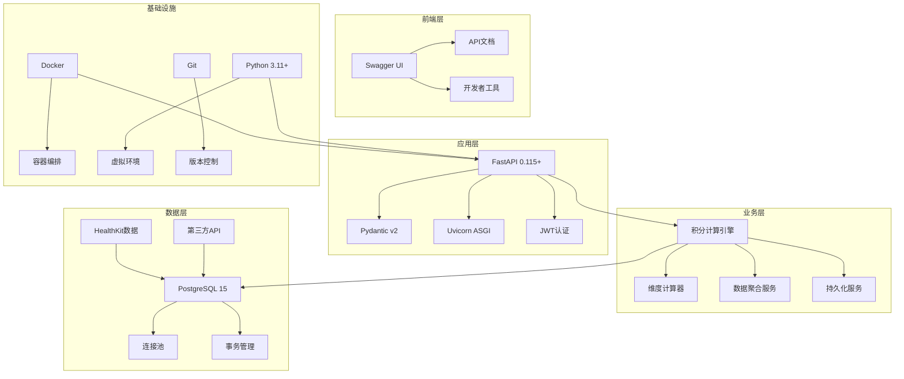

# LSP系统技术栈文档标准

**版本**: v2.0  
**最后更新**: 2025-09-07  
**负责人**: 技术架构师

## 技术选型概览

LSP健康积分系统采用现代化的Python技术栈，注重性能、可维护性和扩展性。本文档定义了技术栈决策、文档标准和最佳实践。

### 技术架构图


## 核心技术栈

### 后端技术栈

| 技术类别 | 选择方案 | 版本 | 选择理由 | 替代方案 |
|---------|----------|------|----------|----------|
| **Web框架** | FastAPI | 0.115.6 | 高性能、自动API文档、类型检查 | Django REST, Flask |
| **ASGI服务器** | Uvicorn | 0.34.0 | 高并发、WebSocket支持 | Gunicorn, Hypercorn |
| **数据验证** | Pydantic | 2.10.1 | 类型安全、数据验证、性能优异 | Marshmallow, Cerberus |
| **配置管理** | pydantic-settings | 2.10.1 | 环境变量自动验证、类型安全 | python-decouple |
| **数据库** | PostgreSQL | 15+ | ACID事务、JSON支持、可扩展性 | MySQL, SQLite |
| **数据库驱动** | psycopg2-binary | 2.9.10 | 成熟稳定、性能优秀 | asyncpg, psycopg3 |
| **数据处理** | pandas | 2.3.1 | 数据分析、CSV处理、时间序列 | polars, numpy |
| **科学计算** | numpy | 2.3.1 | 数值计算、数组操作 | - |
| **统计分析** | scipy | 1.16.0 | 高级统计函数、信号处理 | statsmodels |
| **认证** | python-jose | 3.3.0 | JWT token、加密解密 | PyJWT, authlib |
| **HTTP客户端** | requests | 2.32.3 | 第三方API调用、数据获取 | httpx, aiohttp |

### 开发和部署工具

| 工具类别 | 选择方案 | 版本 | 用途 | 配置文件 |
|---------|----------|------|------|----------|
| **容器化** | Docker | 20+ | 应用打包、环境隔离 | `Dockerfile` |
| **容器编排** | docker-compose | 3.8 | 开发环境、服务编排 | `docker-compose.yml` |
| **Python版本** | Python | 3.11+ | 语言运行时 | `pyproject.toml` |
| **依赖管理** | pip + requirements.txt | - | 包管理 | `requirements.txt` |
| **环境管理** | python-dotenv | 1.1.1 | 环境变量管理 | `.env` |
| **版本控制** | Git | 2.0+ | 代码版本管理 | `.gitignore` |

### 数据源和集成

| 数据类型 | 主要数据源 | 备选数据源 | 集成方式 | 优先级 |
|---------|-----------|-----------|----------|--------|
| **睡眠数据** | Apple HealthKit | Oura, WHOOP, OffScreen | CSV导入/API | 1 |
| **运动数据** | Apple Watch | iPhone步数、第三方tracker | HealthKit同步 | 1 |
| **心率变异性** | Apple Watch | 专业HRV设备 | HealthKit导入 | 2 |
| **环境数据** | AQI API | 智能家居传感器 | RESTful API | 3 |
| **营养数据** | MyFitnessPal | 手动输入 | API集成 | 3 |

## 文档技术标准

### 中文技术文档规范

#### 文档结构标准
```markdown
# [系统/功能]技术文档

**版本**: vX.Y  
**最后更新**: YYYY-MM-DD  
**负责人**: [姓名/团队]  
**审核状态**: Draft/Review/Approved

## 概述
[简要说明技术选择和背景]

## 技术决策
[详细的技术选择理由和对比]

## 实施指南
[具体的实施步骤和配置方法]

## 最佳实践
[使用建议和注意事项]

## 故障排除
[常见问题和解决方案]

---
**修改历史**:
- vX.Y (YYYY-MM-DD): [变更说明]
```

#### 代码注释规范
```python
"""
[功能模块]
[详细的中文功能说明]

主要功能:
- 功能1: 具体说明
- 功能2: 具体说明

使用示例:
    example_code_here()

注意事项:
- 注意点1
- 注意点2
"""

class ExampleClass:
    """示例类：演示代码注释规范"""
    
    def __init__(self, param: str):
        """
        初始化示例类
        
        参数:
            param: 参数说明
        """
        self.param = param  # 参数存储
    
    def process_data(self, data: dict) -> dict:
        """
        处理数据的核心方法
        
        参数:
            data: 输入数据字典
            
        返回:
            处理后的数据字典
            
        异常:
            ValueError: 当数据格式不正确时抛出
        """
        # 数据验证逻辑
        if not isinstance(data, dict):
            raise ValueError("数据必须是字典格式")
        
        # 数据处理逻辑
        result = self._transform_data(data)
        return result
    
    def _transform_data(self, data: dict) -> dict:
        """私有方法：数据转换逻辑"""
        pass  # 具体实现
```

#### 配置文件注释标准
```python
"""
LSP系统全局配置
定义数据库连接、API设置、业务规则等核心配置
"""

from pydantic import BaseSettings

class DatabaseConfig(BaseSettings):
    """数据库连接配置"""
    
    # PostgreSQL数据库配置
    postgres_host: str = "localhost"      # 数据库主机地址
    postgres_port: int = 5432            # 数据库端口
    postgres_user: str = "postgres"      # 数据库用户名
    postgres_password: str               # 数据库密码（必填）
    postgres_database: str = "lsp_db"    # 数据库名称
    
    # 连接池配置
    pool_min_size: int = 5               # 最小连接数
    pool_max_size: int = 20              # 最大连接数
    pool_timeout: int = 30               # 连接超时时间（秒）
    
    class Config:
        env_file = ".env"                # 环境变量文件路径
```

### API文档标准

#### OpenAPI文档规范
```python
from fastapi import FastAPI, Query
from pydantic import BaseModel

app = FastAPI(
    title="LSP健康积分系统API",
    description="提供健康数据分析和积分计算的完整API服务",
    version="2.0.0",
    docs_url="/lsp/docs",     # Swagger UI地址
    redoc_url="/lsp/redoc"    # ReDoc地址
)

class ScoreResponse(BaseModel):
    """积分查询响应模型"""
    
    user_id: str              # 用户ID
    total_score: int          # 总积分
    dimension_scores: dict    # 各维度积分详情
    
    class Config:
        schema_extra = {
            "example": {
                "user_id": "user123",
                "total_score": 5400,
                "dimension_scores": {
                    "sleep": 3000,
                    "exercise": 2400
                }
            }
        }

@app.get(
    "/api/v1/scores/daily",
    response_model=ScoreResponse,
    summary="获取每日积分",
    description="计算用户指定日期的各维度积分总和，支持百分比统计",
    tags=["积分查询"]
)
async def get_daily_score(
    date: str = Query(
        default=None,
        description="查询日期，格式为YYYY-MM-DD，默认为今天",
        example="2025-09-07"
    ),
    user_id: str = Query(
        description="用户ID，用于数据隔离",
        example="user123"
    )
):
    """
    获取用户每日积分详情
    
    - **date**: 查询日期，ISO格式
    - **user_id**: 用户标识符
    
    返回包含各维度积分和百分比统计的详细数据。
    """
    pass  # 实际实现
```

#### 错误处理文档标准
```python
"""
API错误处理标准文档

定义统一的错误响应格式和处理策略，确保API响应的一致性。
"""

from fastapi import HTTPException
from typing import Dict, Any
import logging

# 配置日志
logger = logging.getLogger(__name__)

class APIError(Exception):
    """自定义API异常类"""
    
    def __init__(self, status_code: int, detail: str, error_code: str = None):
        self.status_code = status_code
        self.detail = detail
        self.error_code = error_code

def handle_database_error(error: Exception) -> Dict[str, Any]:
    """
    数据库错误统一处理
    
    参数:
        error: 数据库异常对象
        
    返回:
        标准化的错误响应
    """
    logger.error(f"数据库错误: {str(error)}")
    
    return {
        "detail": "数据库连接或查询失败",
        "error_code": "DATABASE_ERROR",
        "technical_detail": str(error)  # 仅在开发环境返回
    }

# 错误码定义
ERROR_CODES = {
    "INVALID_PARAMETERS": "请求参数格式错误或缺失必填参数",
    "USER_NOT_FOUND": "指定的用户ID不存在",
    "DATE_RANGE_INVALID": "日期范围无效，请检查开始和结束日期",
    "DATABASE_ERROR": "数据库操作失败，请稍后重试",
    "CALCULATION_ERROR": "积分计算引擎错误",
    "UNAUTHORIZED": "认证失败，请提供有效的访问令牌"
}
```

## 开发环境配置

### 本地开发环境设置

#### 1. Python环境配置
```bash
# 创建虚拟环境
python3.11 -m venv venv

# 激活虚拟环境 (macOS/Linux)
source venv/bin/activate

# 激活虚拟环境 (Windows)
venv\Scripts\activate

# 安装依赖
pip install -r requirements.txt

# 验证安装
python -c "import fastapi; print(fastapi.__version__)"
```

#### 2. 数据库配置
```bash
# PostgreSQL安装 (macOS)
brew install postgresql@15
brew services start postgresql@15

# PostgreSQL安装 (Ubuntu)
sudo apt-get install postgresql-15 postgresql-client-15

# 创建数据库和用户
sudo -u postgres psql
CREATE DATABASE lsp_db;
CREATE USER lsp_user WITH ENCRYPTED PASSWORD 'lsp_password';
GRANT ALL PRIVILEGES ON DATABASE lsp_db TO lsp_user;
```

#### 3. 环境变量配置
```bash
# .env文件内容
POSTGRES_HOST=localhost
POSTGRES_PORT=5432
POSTGRES_USER=lsp_user
POSTGRES_PWD=lsp_password
POSTGRES_DBNAME=lsp_db

# JWT配置
JWT_SECRET_KEY=your-secret-key-here
JWT_ALGORITHM=HS256
JWT_EXPIRATION_HOURS=24

# API配置
AUTH_ENABLED=true
LOG_LEVEL=INFO
API_PREFIX=/lsp/api/v1

# 开发模式配置
DEBUG=true
RELOAD=true
```

### Docker开发环境

#### Dockerfile规范
```dockerfile
# 多阶段构建的Python应用容器
FROM python:3.11-slim as base

# 设置工作目录
WORKDIR /app

# 安装系统依赖
RUN apt-get update && apt-get install -y \
    gcc \
    g++ \
    libpq-dev \
    && rm -rf /var/lib/apt/lists/*

# 复制依赖文件
COPY requirements.txt .

# 安装Python依赖
RUN pip install --no-cache-dir -r requirements.txt

# 复制应用代码
COPY . .

# 创建非root用户
RUN useradd --create-home --shell /bin/bash lsp
USER lsp

# 暴露端口
EXPOSE 8000

# 健康检查
HEALTHCHECK --interval=30s --timeout=10s --start-period=5s --retries=3 \
    CMD curl -f http://localhost:8000/lsp/health || exit 1

# 启动命令
CMD ["uvicorn", "src.main:app", "--host", "0.0.0.0", "--port", "8000"]
```

#### docker-compose开发配置
```yaml
version: '3.8'

services:
  # PostgreSQL数据库
  postgres:
    image: postgres:15-alpine
    container_name: lsp-postgres-dev
    environment:
      POSTGRES_USER: lsp_user
      POSTGRES_PASSWORD: lsp_password
      POSTGRES_DB: lsp_db
    ports:
      - "5432:5432"
    volumes:
      - postgres_data:/var/lib/postgresql/data
      - ./scripts/init_db.sql:/docker-entrypoint-initdb.d/init.sql
    healthcheck:
      test: ["CMD-SHELL", "pg_isready -U lsp_user -d lsp_db"]
      interval: 10s
      timeout: 5s
      retries: 5

  # LSP应用
  lsp-app:
    build: .
    container_name: lsp-app-dev
    environment:
      POSTGRES_HOST: postgres
      POSTGRES_PORT: 5432
      POSTGRES_USER: lsp_user
      POSTGRES_PWD: lsp_password
      POSTGRES_DBNAME: lsp_db
      LOG_LEVEL: DEBUG
    ports:
      - "8000:8000"
    volumes:
      - ./src:/app/src  # 开发时代码热重载
      - ./logs:/app/logs
    depends_on:
      postgres:
        condition: service_healthy
    restart: unless-stopped

  # Redis缓存 (可选)
  redis:
    image: redis:7-alpine
    container_name: lsp-redis-dev
    ports:
      - "6379:6379"
    volumes:
      - redis_data:/data

volumes:
  postgres_data:
  redis_data:
```

## 性能优化标准

### 数据库性能优化

#### 连接池配置
```python
"""
PostgreSQL连接池优化配置
确保高并发场景下的稳定性能
"""

import psycopg2
from psycopg2 import pool
from typing import Optional

class PostgreSQLPool:
    """PostgreSQL连接池管理器"""
    
    def __init__(self):
        """初始化连接池"""
        self.connection_pool = psycopg2.pool.ThreadedConnectionPool(
            minconn=5,           # 最小连接数：保持基础连接
            maxconn=20,          # 最大连接数：根据服务器性能调整
            host=config.postgres_host,
            port=config.postgres_port,
            database=config.postgres_database,
            user=config.postgres_user,
            password=config.postgres_password,
            # 连接选项优化
            options='-c statement_timeout=30000',  # 语句超时30秒
            connect_timeout=10,                    # 连接超时10秒
            keepalives_idle=600,                   # 保活间隔10分钟
            keepalives_interval=30,                # 保活检测间隔30秒
            keepalives_count=3                     # 保活重试次数
        )
    
    def get_connection(self):
        """获取数据库连接"""
        try:
            return self.connection_pool.getconn()
        except psycopg2.pool.PoolError as e:
            logger.error(f"连接池错误: {e}")
            raise DatabaseConnectionError("数据库连接池已满")
    
    def return_connection(self, connection):
        """归还数据库连接"""
        try:
            self.connection_pool.putconn(connection)
        except psycopg2.pool.PoolError as e:
            logger.error(f"归还连接错误: {e}")
```

#### 查询优化策略
```python
"""
数据库查询优化最佳实践
"""

# 1. 使用参数化查询，防止SQL注入
def get_user_scores_optimized(user_id: str, start_date: datetime, end_date: datetime):
    """优化的积分查询方法"""
    
    # 使用索引字段进行查询
    query = """
    SELECT 
        dimension,
        SUM(score) as total_score,
        COUNT(*) as record_count
    FROM user_scores 
    WHERE 
        user_id = %s 
        AND date BETWEEN %s AND %s 
        AND is_expired = false
        AND expire_date > CURRENT_DATE
    GROUP BY dimension
    ORDER BY total_score DESC
    """
    
    # 使用连接池执行查询
    with get_db_connection() as conn:
        with conn.cursor(cursor_factory=RealDictCursor) as cursor:
            cursor.execute(query, (user_id, start_date, end_date))
            return cursor.fetchall()

# 2. 批量操作优化
def batch_insert_scores(score_records: List[dict], batch_size: int = 1000):
    """批量插入积分记录"""
    
    query = """
    INSERT INTO user_scores (
        user_id, date, dimension, sub_category, 
        difficulty, score, details, tier_level, expire_date
    ) VALUES %s
    ON CONFLICT (user_id, date, dimension, sub_category) 
    DO UPDATE SET 
        score = EXCLUDED.score,
        details = EXCLUDED.details,
        updated_at = CURRENT_TIMESTAMP
    """
    
    # 分批处理大量数据
    for i in range(0, len(score_records), batch_size):
        batch = score_records[i:i + batch_size]
        values = [
            (
                record['user_id'], record['date'], record['dimension'],
                record['sub_category'], record['difficulty'], record['score'],
                json.dumps(record['details']), record['tier_level'], record['expire_date']
            )
            for record in batch
        ]
        
        with get_db_connection() as conn:
            with conn.cursor() as cursor:
                execute_values(cursor, query, values, page_size=100)
                conn.commit()
```

### API性能优化

#### 缓存策略
```python
"""
API缓存优化策略
减少数据库查询，提升响应速度
"""

import redis
import json
from functools import wraps
from typing import Any, Optional

# Redis连接
redis_client = redis.Redis(host='localhost', port=6379, db=0, decode_responses=True)

def cache_result(expiration: int = 3600, key_prefix: str = "lsp"):
    """
    结果缓存装饰器
    
    参数:
        expiration: 缓存过期时间（秒）
        key_prefix: 缓存键前缀
    """
    def decorator(func):
        @wraps(func)
        async def wrapper(*args, **kwargs):
            # 构建缓存键
            cache_key = f"{key_prefix}:{func.__name__}:{hash(str(args) + str(kwargs))}"
            
            # 尝试从缓存获取
            try:
                cached_result = redis_client.get(cache_key)
                if cached_result:
                    return json.loads(cached_result)
            except redis.RedisError as e:
                logger.warning(f"缓存读取失败: {e}")
            
            # 执行原函数
            result = await func(*args, **kwargs)
            
            # 存储到缓存
            try:
                redis_client.setex(
                    cache_key, 
                    expiration, 
                    json.dumps(result, default=str)
                )
            except redis.RedisError as e:
                logger.warning(f"缓存写入失败: {e}")
            
            return result
        
        return wrapper
    return decorator

# 使用示例
@cache_result(expiration=1800, key_prefix="user_scores")
async def get_user_daily_scores(user_id: str, date: str):
    """获取用户每日积分（带缓存）"""
    # 实际的数据库查询逻辑
    pass
```

#### 异步处理优化
```python
"""
异步处理优化，提升并发处理能力
"""

import asyncio
import asyncpg
from typing import List, Dict

class AsyncPostgreSQLPool:
    """异步PostgreSQL连接池"""
    
    def __init__(self):
        self.pool: Optional[asyncpg.Pool] = None
    
    async def initialize(self):
        """初始化异步连接池"""
        self.pool = await asyncpg.create_pool(
            host=config.postgres_host,
            port=config.postgres_port,
            user=config.postgres_user,
            password=config.postgres_password,
            database=config.postgres_database,
            min_size=5,
            max_size=20,
            command_timeout=30
        )
    
    async def execute_query(self, query: str, *args) -> List[Dict]:
        """执行异步查询"""
        async with self.pool.acquire() as connection:
            rows = await connection.fetch(query, *args)
            return [dict(row) for row in rows]

# 异步批量处理
async def process_multiple_users_async(user_ids: List[str], date: str):
    """异步处理多用户积分计算"""
    
    tasks = []
    for user_id in user_ids:
        task = calculate_user_daily_score_async(user_id, date)
        tasks.append(task)
    
    # 并发执行所有任务
    results = await asyncio.gather(*tasks, return_exceptions=True)
    
    # 处理结果和异常
    success_results = []
    errors = []
    
    for i, result in enumerate(results):
        if isinstance(result, Exception):
            errors.append(f"用户 {user_ids[i]} 处理失败: {result}")
        else:
            success_results.append(result)
    
    return {
        "success_count": len(success_results),
        "error_count": len(errors),
        "results": success_results,
        "errors": errors
    }
```

## 测试标准

### 单元测试规范

#### pytest配置
```python
"""
pytest测试配置和规范
"""

import pytest
from fastapi.testclient import TestClient
from src.main import app
from src.db.postgresql import PostgreSQLPool

@pytest.fixture
def client():
    """FastAPI测试客户端"""
    return TestClient(app)

@pytest.fixture
def test_user_id():
    """测试用户ID"""
    return "test_user_123"

@pytest.fixture
def sample_health_data():
    """示例健康数据"""
    return {
        "date": "2025-09-07",
        "sleep_hours": 7.5,
        "steps": 8532,
        "exercise_minutes": 45
    }

class TestScoreCalculation:
    """积分计算测试类"""
    
    def test_sleep_score_calculation(self, sample_health_data):
        """测试睡眠积分计算"""
        from src.core.calculators.sleep_calculator import SleepCalculator
        
        calculator = SleepCalculator()
        result = calculator.calculate(sample_health_data)
        
        # 断言测试
        assert result['total_score'] == 1000  # 7.5小时睡眠应得1000分
        assert result['details']['easy'] == 1000
        assert result['details']['medium'] == 0  # 未实现中等难度
    
    def test_api_daily_score(self, client, test_user_id):
        """测试每日积分API"""
        response = client.get(
            f"/lsp/api/v1/score/daily?user_id={test_user_id}&date=2025-09-07"
        )
        
        assert response.status_code == 200
        data = response.json()
        assert "total_score" in data
        assert "dimension_scores" in data
        assert "dimension_percentages" in data  # v2.0新增字段
    
    def test_error_handling(self, client):
        """测试错误处理"""
        # 测试无效日期范围
        response = client.get(
            "/lsp/api/v1/scores/history?start_date=2025-10-01&end_date=2025-09-01"
        )
        
        assert response.status_code == 400
        assert "结束日期不能早于开始日期" in response.json()["detail"]

# 性能测试
@pytest.mark.performance
class TestPerformance:
    """性能测试类"""
    
    def test_api_response_time(self, client):
        """测试API响应时间"""
        import time
        
        start_time = time.time()
        response = client.get("/lsp/api/v1/scores/valid")
        end_time = time.time()
        
        response_time = end_time - start_time
        assert response_time < 1.0  # API响应时间应小于1秒
        assert response.status_code == 200

# 数据库测试
@pytest.mark.database
class TestDatabase:
    """数据库操作测试"""
    
    @pytest.fixture(autouse=True)
    def setup_test_data(self):
        """设置测试数据"""
        # 创建测试数据
        yield
        # 清理测试数据
    
    def test_connection_pool(self):
        """测试数据库连接池"""
        pool = PostgreSQLPool()
        
        # 测试获取连接
        connection = pool.get_connection()
        assert connection is not None
        
        # 测试归还连接
        pool.return_connection(connection)
        
    def test_batch_insert_performance(self):
        """测试批量插入性能"""
        # 准备1000条测试数据
        test_records = [
            {
                "user_id": f"test_user_{i}",
                "date": "2025-09-07",
                "dimension": "sleep",
                "score": 1000
            }
            for i in range(1000)
        ]
        
        start_time = time.time()
        # 执行批量插入
        batch_insert_scores(test_records)
        end_time = time.time()
        
        # 批量插入1000条记录应在5秒内完成
        assert end_time - start_time < 5.0
```

### 集成测试配置
```bash
#!/bin/bash
# 集成测试脚本

echo "开始LSP系统集成测试..."

# 1. 启动测试环境
docker-compose -f docker-compose.test.yml up -d

# 等待服务启动
sleep 30

# 2. 运行API测试
echo "运行API接口测试..."
python -m pytest tests/test_api/ -v --tb=short

# 3. 运行性能测试
echo "运行性能测试..."
python -m pytest tests/test_performance/ -v --tb=short -m performance

# 4. 运行数据库测试
echo "运行数据库测试..."
python -m pytest tests/test_database/ -v --tb=short -m database

# 5. 生成测试报告
echo "生成测试报告..."
python -m pytest --cov=src --cov-report=html tests/

# 6. 清理测试环境
docker-compose -f docker-compose.test.yml down

echo "集成测试完成！"
```

## 部署和运维标准

### 生产环境配置

#### 环境变量管理
```bash
# 生产环境配置 (.env.production)
# 数据库配置
POSTGRES_HOST=production-db-host
POSTGRES_PORT=5432
POSTGRES_USER=lsp_prod_user
POSTGRES_PWD=complex-secure-password
POSTGRES_DBNAME=lsp_production

# 安全配置
JWT_SECRET_KEY=super-secure-jwt-secret-key-for-production
AUTH_ENABLED=true
CORS_ORIGINS=https://your-domain.com

# 性能配置
POOL_MIN_SIZE=10
POOL_MAX_SIZE=50
REDIS_URL=redis://production-redis:6379/0

# 监控配置
LOG_LEVEL=INFO
SENTRY_DSN=https://your-sentry-dsn
METRICS_ENABLED=true

# 限流配置
RATE_LIMIT_ENABLED=true
MAX_REQUESTS_PER_MINUTE=1000
```

#### Docker生产配置
```dockerfile
# 生产环境Dockerfile
FROM python:3.11-slim as production

# 安全和性能优化
RUN apt-get update && apt-get install -y \
    --no-install-recommends \
    gcc \
    libpq-dev \
    && rm -rf /var/lib/apt/lists/*

# 创建应用用户
RUN groupadd -r lsp && useradd -r -g lsp lsp

WORKDIR /app

# 复制依赖并安装
COPY requirements.txt .
RUN pip install --no-cache-dir --upgrade pip && \
    pip install --no-cache-dir -r requirements.txt

# 复制应用代码
COPY --chown=lsp:lsp . .

# 切换到应用用户
USER lsp

# 生产环境健康检查
HEALTHCHECK --interval=30s --timeout=10s --start-period=60s --retries=3 \
    CMD curl -f http://localhost:8000/lsp/health || exit 1

# 使用Gunicorn运行生产服务
CMD ["gunicorn", "src.main:app", "-w", "4", "-k", "uvicorn.workers.UvicornWorker", "--bind", "0.0.0.0:8000"]
```

### 监控和日志标准

#### 日志配置
```python
"""
生产环境日志配置
"""

import logging
import sys
from logging.handlers import RotatingFileHandler
from pythonjsonlogger import jsonlogger

def setup_logging():
    """配置生产环境日志"""
    
    # JSON格式化器
    json_formatter = jsonlogger.JsonFormatter(
        '%(asctime)s %(name)s %(levelname)s %(message)s'
    )
    
    # 控制台处理器
    console_handler = logging.StreamHandler(sys.stdout)
    console_handler.setFormatter(json_formatter)
    
    # 文件处理器（轮转）
    file_handler = RotatingFileHandler(
        'logs/lsp-system.log',
        maxBytes=100*1024*1024,  # 100MB
        backupCount=10
    )
    file_handler.setFormatter(json_formatter)
    
    # 错误日志处理器
    error_handler = RotatingFileHandler(
        'logs/lsp-errors.log',
        maxBytes=50*1024*1024,   # 50MB
        backupCount=5
    )
    error_handler.setLevel(logging.ERROR)
    error_handler.setFormatter(json_formatter)
    
    # 配置根日志器
    root_logger = logging.getLogger()
    root_logger.setLevel(logging.INFO)
    root_logger.addHandler(console_handler)
    root_logger.addHandler(file_handler)
    root_logger.addHandler(error_handler)
    
    # 第三方库日志级别
    logging.getLogger('uvicorn.access').setLevel(logging.WARNING)
    logging.getLogger('asyncio').setLevel(logging.WARNING)
```

## 版本更新和迁移

### 数据库版本管理

#### 迁移脚本模板
```python
"""
数据库迁移脚本模板
版本: v2.0
日期: 2025-09-07
说明: 新增积分百分比功能相关字段
"""

import psycopg2
from datetime import datetime

def migrate_up(connection):
    """执行升级迁移"""
    cursor = connection.cursor()
    
    try:
        # 添加新字段
        cursor.execute("""
            ALTER TABLE user_scores 
            ADD COLUMN IF NOT EXISTS percentage DECIMAL(5,2),
            ADD COLUMN IF NOT EXISTS max_possible_score INTEGER
        """)
        
        # 创建新索引
        cursor.execute("""
            CREATE INDEX IF NOT EXISTS idx_user_scores_percentage 
            ON user_scores(percentage) 
            WHERE percentage IS NOT NULL
        """)
        
        # 更新现有数据
        cursor.execute("""
            UPDATE user_scores 
            SET max_possible_score = CASE 
                WHEN dimension = 'sleep' THEN 17000
                WHEN dimension = 'exercise' THEN 21480
                WHEN dimension = 'diet' THEN 1000
                WHEN dimension = 'mental' THEN 4000
                ELSE 0
            END
            WHERE max_possible_score IS NULL
        """)
        
        connection.commit()
        print("迁移 v2.0 执行成功")
        
    except Exception as e:
        connection.rollback()
        print(f"迁移失败: {e}")
        raise

def migrate_down(connection):
    """执行回滚迁移"""
    cursor = connection.cursor()
    
    try:
        # 删除添加的字段
        cursor.execute("""
            ALTER TABLE user_scores 
            DROP COLUMN IF EXISTS percentage,
            DROP COLUMN IF EXISTS max_possible_score
        """)
        
        # 删除创建的索引
        cursor.execute("""
            DROP INDEX IF EXISTS idx_user_scores_percentage
        """)
        
        connection.commit()
        print("回滚 v2.0 执行成功")
        
    except Exception as e:
        connection.rollback()
        print(f"回滚失败: {e}")
        raise

if __name__ == "__main__":
    # 连接数据库
    connection = psycopg2.connect(
        host="localhost",
        port=5432,
        user="lsp_user", 
        password="lsp_password",
        database="lsp_db"
    )
    
    # 执行迁移
    migrate_up(connection)
    connection.close()
```

## 技术债务管理

### 代码质量标准

#### 代码质量工具配置
```toml
# pyproject.toml - 代码质量工具配置

[tool.black]
line-length = 120
target-version = ['py311']
include = '\.pyi?$'
extend-exclude = '''
/(
  # 排除目录
  \.eggs
  | \.git
  | \.hg
  | \.mypy_cache
  | \.tox
  | \.venv
  | build
  | dist
)/
'''

[tool.isort]
profile = "black"
line_length = 120
multi_line_output = 3

[tool.pylint]
max-line-length = 120
disable = [
    "missing-docstring",
    "too-few-public-methods"
]

[tool.mypy]
python_version = "3.11"
warn_return_any = true
warn_unused_configs = true
disallow_untyped_defs = true
```

#### 技术债务清单
```markdown
# LSP系统技术债务清单

## 高优先级债务

### 1. 测试覆盖率不足
**现状**: 单元测试覆盖率约25%  
**目标**: 提升至60%以上  
**影响**: 代码质量和维护性  
**预估工作量**: 3-5天  

### 2. 缺少异步数据库操作
**现状**: 使用同步psycopg2  
**目标**: 迁移到asyncpg  
**影响**: 性能和并发能力  
**预估工作量**: 2-3天  

### 3. 缺少API限流机制
**现状**: 无请求频率限制  
**目标**: 实现基于用户的限流  
**影响**: 系统稳定性和安全性  
**预估工作量**: 1-2天  

## 中优先级债务

### 4. 配置管理分散
**现状**: 配置分布在多个文件中  
**目标**: 统一配置管理  
**影响**: 维护复杂度  
**预估工作量**: 1天  

### 5. 缺少缓存机制
**现状**: 每次请求都查询数据库  
**目标**: 引入Redis缓存  
**影响**: 性能优化  
**预估工作量**: 2-3天  

## 低优先级债务

### 6. 日志结构化不足
**现状**: 日志格式不统一  
**目标**: 实现结构化JSON日志  
**影响**: 监控和调试效率  
**预估工作量**: 1天  
```

---

**文档版本**: v2.0  
**创建日期**: 2025-09-07  
**负责人**: 技术架构师  
**审核状态**: Draft

**修改历史**:
- v2.0 (2025-09-07): 完整的技术栈文档标准，包含开发规范、性能优化、测试标准和部署指南
- v1.0 (2025-07-22): 基础技术选型说明